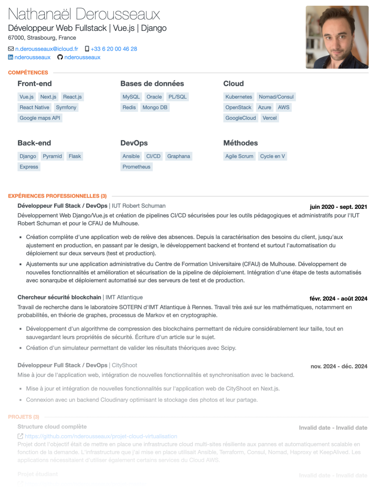

<p align="center">
	
</p>

<p align="center">
	
</p>

# <div align="center">My resume</div>
<div align="center">
	<samp>My resume, and some tools related to it.</samp>
</div>

<hr>

## ℹ️ About
This is my online resume. Made with express, [json-resume](https://jsonresume.org) and [my french version of the stackoverflow theme](https://github.com/nderousseaux/jsonresume-theme-stackoverflow-french). 

The deployment is done via vercel.
<p align="center">
	
</p>

## 📚 Features

- `GET /` : Get the resume in the html format. (`curl https://cv.nderousseaux.fr > resume.html`)
- `GET /pdf` : Get the resume in the pdf format. (`curl https://cv.nderousseaux.fr/pdf > resume.pdf`)
- `GET /json` : Get the resume in the json format. (`curl https://cv.nderousseaux.fr/json > resume.json`)

You can also use it for build your own resume :
- `POST /`: Post a json resume, and get the html resume. (`curl -X POST -H "Content-Type: application/json" -d @resume.json https://cv.nderousseaux.fr > resume.html`)
- `POST /pdf`: Post a json resume, and get the pdf resume. (`curl -X POST -H "Content-Type: application/json" -d @resume.json https://cv.nderousseaux.fr/pdf > resume.pdf`)

## 🛠️ Installation, development and deployment

### Installation
```bash
$ npm install
$ mv .env.example .env
```

Fill the `.env` file with your own values. Then, init the database with the `struct.sql` file :

```bash
$ plsql -U <user> -d <database> -f struct.sql
```

And finally, fill the database with your own data.


### Development
```bash
$ npm run dev 
#or, with vercel
$ vercel dev
```

### Deployment
```bash
$ vercel --prod
```

Or simply push to the main branch, if you have the vercel integration enabled.